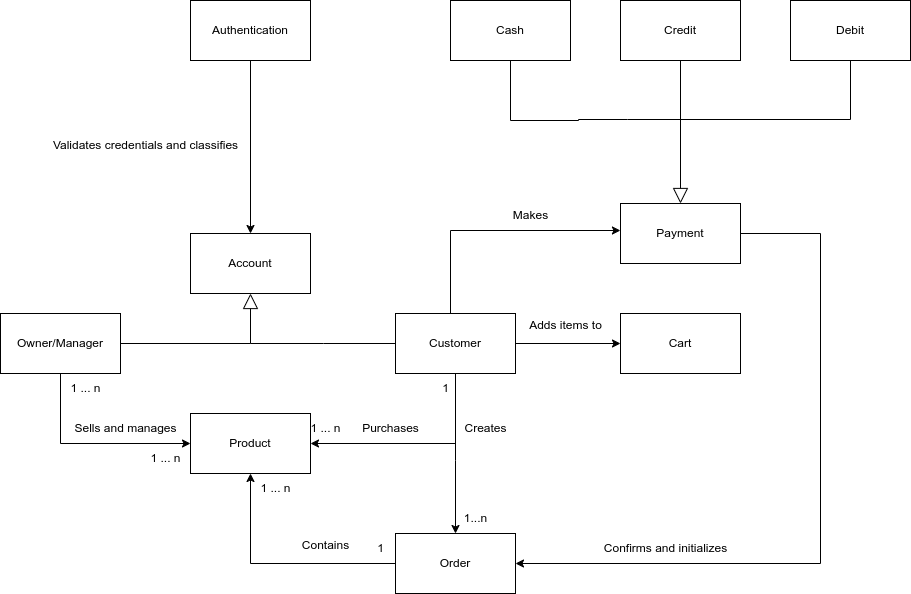
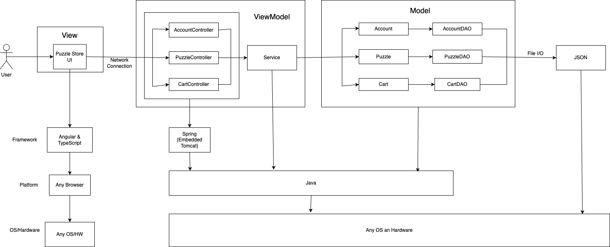
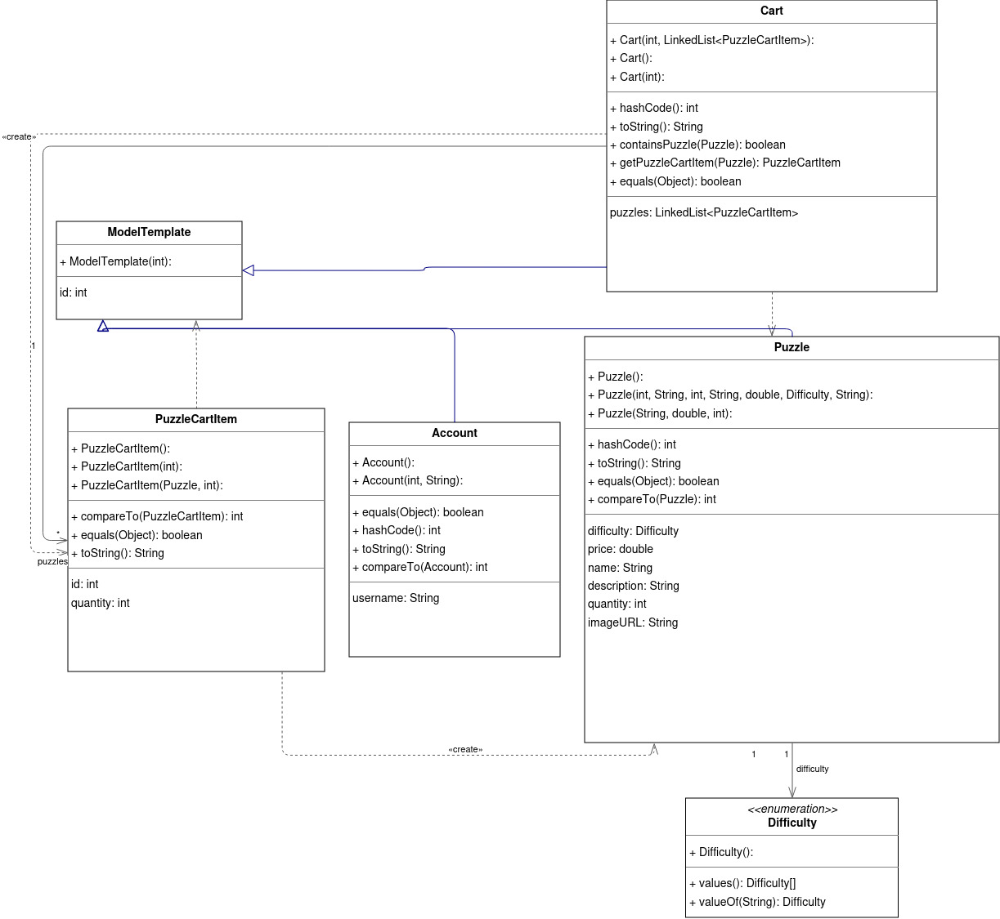
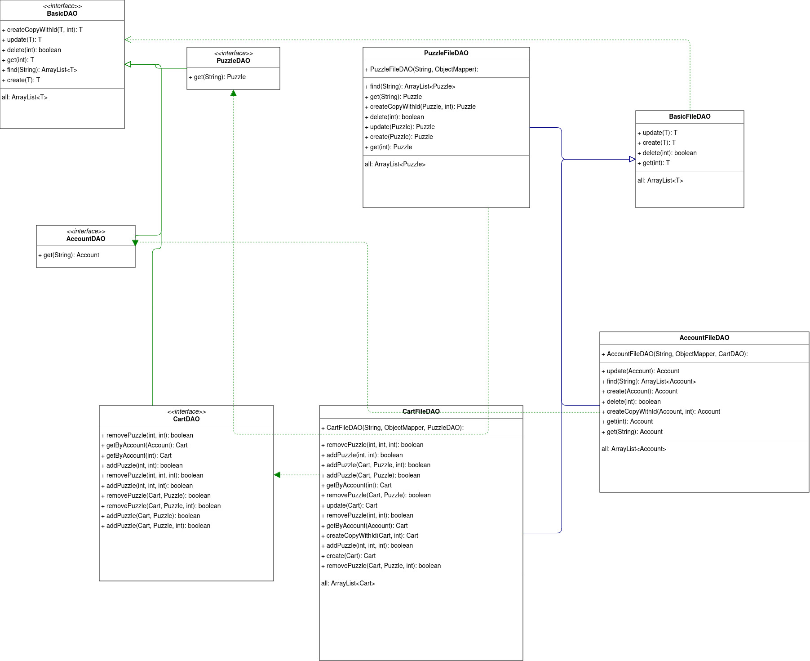
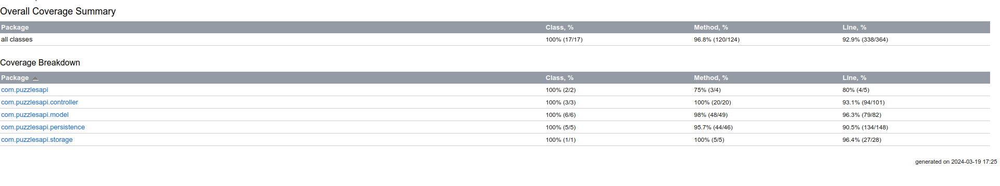

# PROJECT Design Documentation

## Team Information
* Team name: Good Vibes
* Team members
  * Klejdis
  * Ashrith
  * Sejal
  * Jon
  * Nicholas

## Executive Summary

This is a Puzzles E-Store application.
### Purpose

 The primary goal of this project is to develop an e-commerce website dedicated to selling puzzles. The platform aims to provide a seamless online shopping experience for customers while offering a comprehensive management system for the store owner.

### Glossary and Acronyms
| Term | Definition                        |
|------|-----------------------------------|
| SPA  | Single Page                       |
| MVVM | Model-View-ViewModel              |
| API  | Application Programming Interface |
| REST | Representational State Transfer   |
| CRUD | Create, Read, Update, Delete      |
| UML  | Unified Modeling Language         |
| OOP  | Object-Oriented Programming       |
| TDD  | Test-Driven Development           |
| DAO  | Data Access Object                |

## Requirements

### Definition of MVP 
 The Minimum Viable Product (MVP) for this ecommerce store project is a basic
 version of the ecommerce platform that includes essential features to demonstrate
 the core functionality of the system. The MVP aims to provide a functional and user-friendly
 platform for both customers and the e-store owner, focusing on the core features that are
 necessary for the initial launch.

#### Key Features of the MVP:

#### 1. Authentication:
 * ***Minimal Authentication***: The system will implement a basic authentication mechanism that allows
 users to log in and log out. The authentication process will be simplified, trusting the browser
 to identify the user. A simple username is required for login, with the assumption that logging in
 as an admin represents the e-store owner. This approach is not secure and is acknowledged as such,
 focusing instead on the functionality rather than security for the MVP.

#### 2. Customer Functionality:
 * ***Product Listing:*** Customers can view a list of available products.
 * ***Product Search:*** Customers can search for specific products within the store.
 * ***Shopping Cart Management:*** Customers can add or remove items from their shopping cart.
 * ***Checkout Process:*** Customers can proceed to check out their items for purchase, completing the transaction process.

 #### 3. Inventory Management:
E-Store Owners can manage the inventory by adding, removing, and editing product data. This
functionality is crucial for maintaining the store's stock and ensuring that customers can
purchase the items they are interested in.

 #### 4. Data Persistence:
The system will save all data to files, ensuring that changes made by one user (such as adding items to a shopping cart) are persisted and visible to other users upon their next login. This approach replaces the use of a database for the MVP, focusing on the use of basic file I/O operations to achieve data persistence.

   
### MVP Features

#### Epics
* Inventory Management
   1. As an owner, I want to add new products to the inventory, so that the business always stays up to date with recent trends.
   2. As an owner, I want to edit the data of any product in the inventory, so that the presentation to the customer is as perfect as possible.
   3. As an owner, I want to remove an inventory item, so that the customers do not see out of stock or gone products in the website.
* Authentication and Accounts
   1. As an owner, I want the users to log in using a unique username, so that everyone can easily log in and make purchases.
   2. As an owner, I want the user’s cart to be the same across devices, so that it is easier to buy wanted products at a later time.
   3. As an owner, I want to offer the option to save payment information, so that there is no need for the users to spend time on it more than once.
* User Interaction with the Platform
   1. As a user, I want to see all available products in the page, so that I am aware of all the options and can make a better purchase decision.
   2. As a buyer, I want to be able to search for a specific product by its code or category so that I can find exactly what I need easily.
   3. As a buyer, I want to add products I like to cart, so that I can easily find them should I choose to make a purchase later.
   4. As a buyer, I want checkout to offer different payment methods, so that I can make the purchase as quickly as possible.

### Enhancements
#### Main
1. Customized Puzzles
   
   **Story**: As a User, I want to be able to generate a puzzle from an image, so that I can have the item that I exactly want.

   * Customers can submit their own images and order custom puzzles.
   * The custom puzzle will get created and then added to their cart, but not to the actual store inventory.
2. Gift Options 
   
   **Story**: As a User, I want to be able to write gift note-cards and send the puzzle to an email address of my choice, so that I can make the day of my puzzle-lover friends.

   * Customers can choose to gift the puzzles to someone else.
   * When the option is turned on, the buyer has to enter the email of the gift recipient and a message for them.
   * After checkout is done, the order details are emailed to the gift recipient together with the message from the buyer.
#### Other
1. Saved Payment Information
   * When a user checks out for the first time, they have the ability to save their card.
   * On another purchase, they can choose to use the saved payment information instead of having to write it all over again.
   * They can save as many different credit cards as they want.
2. Admin Stats Page
   
   Admin has access to valuable insights regarding sales. Those include:
   * Total Number of Orders
   * Total Revenue 
   * Best Selling Puzzle
   * Best Customer (spent the most money)
3. Order History for Admin/Customer
4. Owned Puzzles Page for User
5. Low Stock Emails

## Application Domain

This section describes the application domain.

**Authentication**:
We implemented minimal authentication by just requiring the user to provide the username when logging in. The username is checked for existence and if true, the user is logged in.
* adm

**Account:**
The Account entity represents the user profiles within our system. It is an essential component that interacts with the Authentication system to provide personalized experiences for users, differentiating between customer accounts and those with elevated privileges, such as business owners and managers.

**Owner/Manager:**
This role within our application has administrative privileges, allowing for the management and oversight of product listings. Owners and managers can handle various aspects of inventory, from adding new products to updating existing listings, reflecting the one-to-many relationship between Owner/Manager and Product entities.

**Product:**
As a central entity in our application, Products represent the goods available for purchase. Each product can be associated with multiple purchases and can be added to carts by customers, highlighting the flexibility and dynamic nature of our inventory system.

**Customer:**
The Customer entity is designed to encapsulate all aspects of the shopper’s experience. Customers can create a cart, add products to it, and proceed to make purchases. We maintain a one-to-one relationship between a Customer and a Cart to ensure a singular focus during the shopping process, while also facilitating multiple purchases over time, as indicated by the one-to-many relationship with Purchases.

**Cart:**
Serving as a temporary holding place for selected products, the Cart entity is pivotal in the purchasing process. It allows customers to review and modify their selections before finalizing their order, with the one-to-one relationship between Cart and Order ensuring a streamlined transition from selection to purchase.

**Order:**
This entity captures the details of transactions completed by customers. Once a cart's selections are confirmed, an Order is created, encapsulating all the necessary details of the purchased items. The one-to-many relationship with the Cart entity indicates that each order originates from a single cart.

**Payment:**
We've designed the Payment entity to process transactions within the application. It supports various payment methods — Cash, Credit, and Debit — to accommodate customer preferences. The relationship between Payment and Order is structured such that each order is matched with a corresponding payment transaction.

**Cash, Credit, Debit:**
These sub-entities under Payment provide customers with multiple payment options. This flexibility ensures that the application caters to a wider customer base, improving accessibility and convenience.

## Architecture and Design

This section describes the application architecture.

### Summary

The web application, is built using the Model–View–ViewModel (MVVM) architecture pattern. 

The Model stores the application data objects including any functionality to provide persistence. 

The View is the client-side SPA built with Angular utilizing HTML, CSS and TypeScript. The ViewModel provides RESTful APIs to the client (View) as well as any logic required to manipulate the data objects from the Model.

Both the ViewModel and Model are built using Java and Spring Framework. Details of the components within these tiers are supplied below.

### Overview of User Interface

Our Puzzles E-Store application provides a user-friendly interface that allows customers to navigate through the website with ease. Here's a summary of the application's user interface from a user's perspective:  

**1. Home Page:** Upon entering the website, users are greeted with the home page. This page displays a variety of puzzles available for purchase. Users can browse through the puzzles, view their details, and add them to their shopping cart directly from this page.  

**2. Product Listing:** Users can navigate to the product listing page to view a comprehensive list of all available puzzles. Each product listing includes an image of the puzzle, its name, price, and a brief description. Users can click on a product to view more details.  

**3. Product Details:** The product details page provides more in-depth information about a specific puzzle. Users can view a larger image of the puzzle, read a detailed description, and see customer reviews. From this page, users can add the puzzle to their shopping cart.  

**4. Shopping Cart:** The shopping cart page displays all the puzzles that the user has added to their cart. Users can view the total price of their cart, update the quantity of each puzzle, or remove puzzles from their cart. From this page, users can proceed to checkout.  

**5. Checkout:** The checkout page allows users to finalize their purchase. Users can enter their shipping and payment information and review their order before confirming the purchase.  

**6. Authentication:** The authentication page allows users to log in and log out of their accounts. Upon logging in, users can view their account details, order history, and manage their shopping cart.  

**7. Search:** The search functionality allows users to find specific puzzles within the store. Users can enter keywords into the search bar, and the application will display all puzzles that match the search criteria.  

**8. Custom Puzzle Products:** This feature allows users to submit their own images and order custom puzzles. The custom puzzle gets created and then added to their cart, but not to the actual store inventory.  

**9. Gift Options:** This feature allows users to choose to gift the puzzles to someone else. They can write a gift message and the email of the gift recipient. The product gets emailed to the recipient with the message.

### ViewModel Tier
> * AccountController
> * PuzzleController
> * PaymentController
> * OrderController
> * GiftController
> * CustomPuzzleController
> * CartController \
> Each controller provides the url mappings that 
> make the client/server communiation possible.
> For example, the client makes a request to an
> /account url, the controller interprets it and 
> delegates the task to the persistence layer.

### Model Tier

Every class in the model has one common thing, the id. That is why every class that was used to model inherits from it.
The classes that inherit from ModelTemplate are:
* Puzzle
* Account
* Cart 

`PuzzleCartItem` is used inside the cart, to store the product together with the quantity in the cart. 

#### Persistence

Now we can explain why ModelTemplate is needed.
It was needed to create a `BasicDao`, an interface that supports all the basic CRUD operations. Basic Dao has a generic type, but the only condition is that the type must extend `ModelTemplate`. `BasicFileDao` implements it and provides all the basic operations for file based persistence, utilizing the FileStorage class. The following interfaces extend ``BasicDao<T extends ModelTemplate>``:
* `PuzzleDAO<Puzzle>`
* `AccountDAO<Account>`
* `CartDao<Cart>`

The following classes extend `BasicFileDao<T extends ModelTemplate` and implement the respective interfaces:

>PuzzleFileDAO
> * `AccountFileDAO`
> * `CartFileDAO`

## OO Design Principles

#### 1. Single Responsibility Principle (SRP):
We ensured that each class in our project has a well-defined role and responsibility. For instance, our Puzzle class is solely responsible for holding puzzle data. It doesn't concern itself with other functionalities like data persistence or user authentication. We delegated these responsibilities to other classes like PuzzleFileDao and AccountController.

#### 2. Open/Closed Principle (OCP):
   We partially adhered to this principle with the use of enums and the controller structure. However, we identified room for improvement. For example, our Difficulty enum can be extended to include more difficulty levels without modifying the existing code.

#### 3. Liskov Substitution Principle (LSP):
   We used inheritance in our DAO classes to adhere to this principle. For example, our PuzzleFileDao extends BasicFileDao and implements PuzzleDao. This means that wherever BasicFileDao is used, PuzzleFileDao can be substituted without affecting the program's functionality.
#### 4. Interface Segregation Principle (ISP):
   We created specific DAO interfaces for each entity to adhere to this principle. For example, we created a PuzzleDao interface specifically for the Puzzle entity. This ensures that classes implementing PuzzleDao are not forced to depend on methods they do not use.
#### 5. Dependency Inversion Principle (DIP):
   We used Spring Framework's dependency injection in our controllers to adhere to this principle. For example, in our PuzzleController, the PuzzleDao is injected via the constructor. This ensures that PuzzleController is not directly dependent on the low-level PuzzleFileDao implementation. Instead, it depends on the abstraction (PuzzleDao).
   

## Testing
We have written 168 JUnit tests(backend only) and all of them pass. Tests span across all tiers and cover about 90 percent of all testable code.

### Acceptance Testing
> All 8 user stories passed acceptance testing.

### Unit Testing and Code Coverage
The strategy we used to approach testing was to make sure that for every method we would test as many branches as we could in a single test. Testing the normal cases, the failing cases, any errors and how it responds. We repeatedly ran coverage tests and examined the methods we were testing to make sure that the potential outcomes were all accounted for and tested, ones that could be JUnit tested. We aimed for 90%+ in coverage as it seems to be the standard for good coverage, which we obtained after maticulous branch and method testing and use of many Mockito elements for all the back-end dependancies required for each tier and all the objects enclosed to make the database work.  

#### Coverage Report

# Links
 [Backend Documentation](puzzles-api/README.md)
. 
 [Frontend Documentation](estore-ui/README.md)
